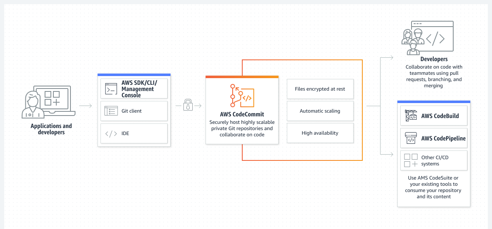

# AWS CodeCommit

## Funcionamento
O CodeCommit funciona de forma semelhante ao github, contudo sua interface é muito mais voltada a observação, além de que o controle de versionamento do github funciona de forma um pouco diferente.

Por exemplo, no GitHub você tem opções de issues que já utilizamos em aulas o kanban e etc. No CodeCommit você não vai ter exatamente dessa forma, mas a aws oferece sistemas e opções para utilizar em conjunto ao CodeCommit, como uma Lambda Function ou algo assim.



### As vantagens do aws CodeCommit são:
- Remover a necessidade de hospedar, manter, fazer backup ou escalar seus próprios servidores de controle de origem.
- Personalizar o acesso do usuário.
- Manter os repositórios altamente disponíveis e acessíveis.
- Manter seus repositórios próximos do ambiente de compilação.

Sabendo disso, com o CodeCommit ele oferece um local seguro e que pode se juntar com outros serviços em nuvem, tornando um programa simples em uma estrutura que estará ligado a todo o seu sistema.

## Tutorial de Criação de um Repositório no CodeCommit
Para utilizar esse tutorial, vamos utilizar o auxílio do Cloud9 como IDE para visualizar e editar os arquivos.

- Pré requisito: Cloued9: Amazon Linux ou Ubuntu e Conexão via SSH.

1. Abrir o console do CodeCommit;

2. Clicar no botão de "Criar Repositório" e preencher o necessário;

3. Após criar, na "Etapas de Conexão", selecione HTTPS(GRC) copie o comando de git clone;

4. Abra o Cloud9, e use o comando no terminal. Após a criação da pasta do repositório, use o comando para entrar na pasta;

5. Teste os comandos git, crie um arquivo de texto ou na linguagem que deseja. (Se não estiver no cloud9 e sim no ambiente do local, é necessário configurar seu login);

    1. Crie um arquivo.
    2. Use o comando comando abaixo, ele irá adicionar todos os arquivos alterados/criados.
    ``` git add -A ```
    3. Utilize o comando abaixo para criar o commit, adicionalmente é possível adicionar mensagens para o commit.
    ``` git commit ```
    4. Visualize no console do Code Commit.

6. É possível criar novas ramificações ou Branchs;

    1. Utilize o comando:
    ``` git branch nome_da_branch ```

    2. Para trocar de branch use:
    ``` git checkout nome_da_branch ```

    3. Repita o processo para realizar um commit no passo 5 para subir a nova branch;

    4. Ao realizar o `` git push `` se atente que para realizar somente na nova branch, é preciso adicionar mais algumas coisas no comando:
    ` git push --set-upstream origin nome_da_branch` ou ` git push -u origin nome_da_branch `

    5. Após isso é possível visualizar no CodeCommit a nova Branch.

7. Agora você pode utilizar o CodeCommit como seu repositório e suas funções. Após realizar a criação da branch nova, pode utilizar o ` git push ` como normalmente;